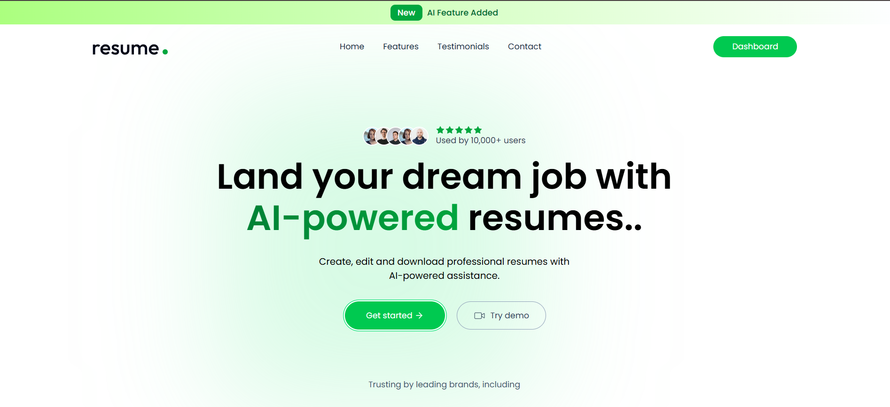
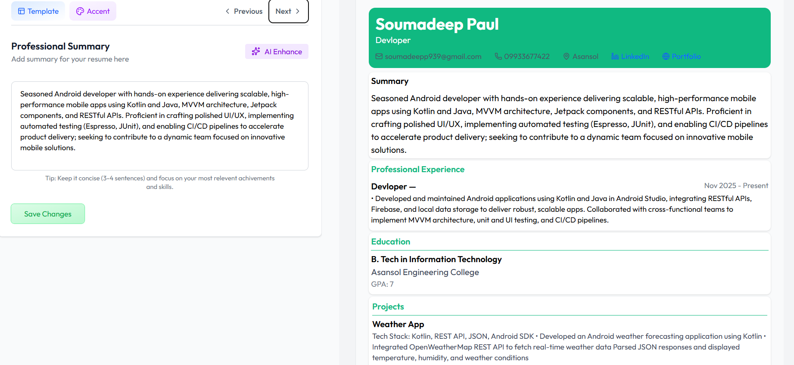
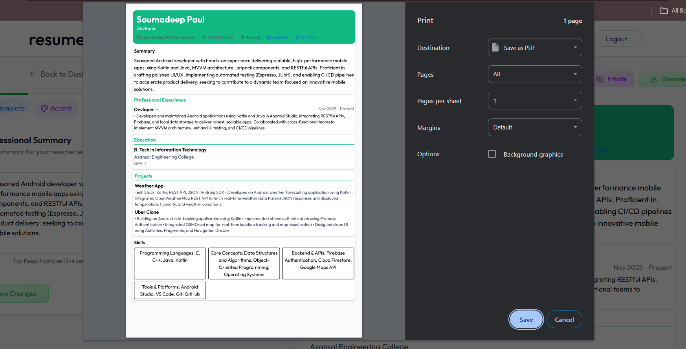

# AI Resume Builder

A full-stack AI-powered Resume Builder that allows users to create, enhance, and download professional resumes using AI.

## 🚀 Live Demo
https://resume-builder-frontend-gold-mu.vercel.app

---

## 📸 Screenshots

### Home Page


### Resume Builder


### Resume Preview


---

## 🛠 Tech Stack

Frontend
- React
- Vite
- Tailwind CSS

Backend
- Node.js
- Express.js

Database
- MongoDB

AI Integration
- OpenAI API

Deployment
- Frontend: Vercel
- Backend: Render

---

## ✨ Features

- User Authentication (Register / Login)
- Upload existing resume
- AI-powered resume parsing
- AI-enhanced professional summary
- AI-enhanced job description
- Multiple resume templates
- Resume preview
- Download resume as PDF

---

## 📂 Project Structure

```
Resume-builder-app
│
├── client        # React frontend
│
├── server        # Node.js backend
│
└── README.md
```

---

## ⚙️ Installation

Clone the repository

```
git clone https://github.com/Soumadeep7/Resume-builder-app.git
```

Install dependencies

```
cd client
npm install

cd ../server
npm install
```

Run the project

```
npm run dev
```

---

## 👨‍💻 Author

Soumadeep Paul
